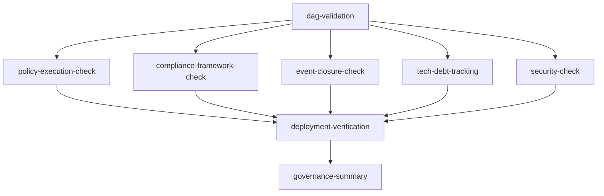

# CI Pipeline Refactoring Guide | CI 管線重構指南

> **Version**: 1.0.0 | **Last Updated**: 2025-12-12

## 📋 Overview | 概述

This guide documents the refactoring of SynergyMesh's CI pipeline from 70+ fragmented
workflows to a streamlined governance-focused CI system with 7 core jobs.

本指南記錄了 SynergyMesh CI 管線從 70 多個碎片化工作流重構為 7 個核心治理 CI 工作的過程。

---

## 🎯 Goals | 目標

### Problems Addressed | 解決的問題

1. **Fragmentation (碎片化)**: 73 active workflows + 8 disabled = high maintenance cost
2. **Overlap (重疊)**: Multiple workflows doing similar validation/security checks
3. **Traceability (可追溯性)**: Difficult to understand which workflows are essential
4. **Cost (成本)**: Excessive CI minutes consumed by redundant jobs

### Target State | 目標狀態

| Before | After |
|--------|-------|
| 73+ active workflows | 7-10 core workflows + reusable components |
| Fragmented governance checks | Single `governance-closed-loop-ci.yml` |
| Overlapping security scans | Consolidated security check |
| Multiple validation workflows | Unified DAG + compliance validation |

---

## 📊 Workflow Classification | 工作流分類

### Category 1: Essential Foundation (必要基礎) ✅ KEEP

These workflows handle core build, test, and deployment operations.

| Workflow | Purpose | Action |
|----------|---------|--------|
| `01-validate.yml` | Lint and format validation | Keep |
| `02-test.yml` | Multi-language test suite | Keep |
| `03-build.yml` | Build matrix (TS/Rust/Go/Java) | Keep |
| `04-deploy-staging.yml` | Staging deployment | Keep |
| `05-deploy-production.yml` | Production deployment | Keep |
| `06-security-scan.yml` | Core security scanning | Keep |
| `07-dependency-update.yml` | Dependency updates | Keep |
| `release.yml` | Release management | Keep |
| `codeql.yml` | CodeQL security analysis | Keep |

### Category 2: Governance (治理相關) 🔄 CONSOLIDATE

These workflows are consolidated into `governance-closed-loop-ci.yml`.

| Workflow | Consolidates Into | New Job |
|----------|-------------------|---------|
| `governance-validation.yml` | governance-closed-loop-ci | DAG Validation |
| `gac-validation.yml` | governance-closed-loop-ci | Policy Execution |
| `compliance-report.yml` | governance-closed-loop-ci | Compliance Framework |
| `arch-governance-validation.yml` | governance-closed-loop-ci | All governance jobs |
| `conftest-validation.yml` | governance-closed-loop-ci | Policy Execution |
| `policy-simulate.yml` | governance-closed-loop-ci | Policy Execution |

### Category 3: Redundant/Overlapping (冗餘/重疊) ⚠️ DEPRECATE

These workflows overlap with others or are outdated.

| Workflow | Reason | Action |
|----------|--------|--------|
| `eslint.yml` | Covered by `01-validate.yml` | Mark deprecated |
| `docs-lint.yml` | Covered by `01-validate.yml` | Mark deprecated |
| `validate-yaml.yml` | Covered by governance CI | Mark deprecated |
| `python-validation.yml` | Covered by `02-test.yml` | Mark deprecated |
| `language-check.yml` | Covered by `01-validate.yml` | Mark deprecated |
| `build-linux.yml` | Can use reusable workflow | Consider merge |
| `build-macos.yml` | Can use reusable workflow | Consider merge |
| `build-windows.yml` | Can use reusable workflow | Consider merge |

### Category 4: Automation/Self-Healing (自動化) 📦 EVALUATE

| Workflow | Purpose | Recommendation |
|----------|---------|----------------|
| `autofix-bot.yml` | Auto-fix issues | Keep if valuable |
| `auto-vulnerability-fix.yml` | Security remediation | Keep |
| `self-healing-ci.yml` | CI self-repair | Evaluate ROI |
| `autonomous-ci-guardian.yml` | CI monitoring | Evaluate ROI |
| `ci-failure-auto-solution.yml` | Auto-fix failures | Evaluate ROI |

### Category 5: Utility/Support (工具支援) 🔧 REVIEW

| Workflow | Purpose | Action |
|----------|---------|--------|
| `label.yml` | PR labeling | Keep (low cost) |
| `stale.yml` | Stale PR management | Keep (low cost) |
| `static.yml` | Static site deployment | Keep |
| `reusable-*.yml` | Reusable workflows | Keep/Enhance |
| `copilot-setup-steps.yml` | Copilot integration | Keep |
| `island-ai-setup-steps.yml` | Island AI setup | Keep |

---

## 🏗️ New Governance Closed-Loop CI | 新治理閉環 CI

The new `governance-closed-loop-ci.yml` consolidates all governance checks into 7 core
jobs:

### Job Structure | 工作結構

```
governance-closed-loop-ci.yml
├── 1️⃣ dag-validation         # DAG 驗證
├── 2️⃣ policy-execution-check  # 策略執行檢查
├── 3️⃣ compliance-framework    # 合規框架檢查
├── 4️⃣ event-closure-check    # 事件閉環檢查
├── 5️⃣ tech-debt-tracking     # 技術債務追蹤
├── 6️⃣ security-check         # 安全檢查
├── 7️⃣ deployment-verification # 部署驗證
└── 📊 governance-summary      # 摘要報告
```

### Job Dependencies | 工作依賴



### What Each Job Checks | 各工作檢查內容

| Job | Checks | Failure Criteria |
|-----|--------|------------------|
| DAG Validation | Circular dependencies, missing deps, orphans | Cycles detected |
| Policy Execution | Required dimensions have structure | Missing config files |
| Compliance Framework | ISO-42001, NIST-AI-RMF coverage | Blocking controls not implemented |
| Event Closure | Causal chain completeness | Bootstrap files missing |
| Tech Debt Tracking | TODO/FIXME/DEBT markers | Informational only |
| Security Check | SBOM, attestations, SLSA level | Missing security artifacts |
| Deployment Verification | All artifacts ready | Index/config missing |

---

## 📅 Migration Timeline | 遷移時間表

### Phase 1: Short-Term (短期) - Week 1-2

- [x] Create `governance-closed-loop-ci.yml`
- [x] Create `CI_REFACTORING_GUIDE.md`
- [ ] Test new governance CI on feature branch
- [ ] Document deprecated workflows

### Phase 2: Mid-Term (中期) - Week 3-4

- [ ] Add deprecation notices to redundant workflows
- [ ] Update documentation references
- [ ] Monitor CI costs before/after
- [ ] Gather feedback from team

### Phase 3: Long-Term (長期) - Month 2-3

- [ ] Remove deprecated workflows
- [ ] Consolidate platform-specific builds
- [ ] Finalize reusable workflow patterns
- [ ] Complete transition to governance-centric CI

---

## 📈 Expected Benefits | 預期效益

| Metric | Before | After | Improvement |
|--------|--------|-------|-------------|
| Active workflows | 73 | ~15-20 | -70% |
| Governance checks | Fragmented | 7 unified | Centralized |
| CI minutes/PR | High | Reduced | ~50% savings |
| Maintenance burden | High | Low | Simplified |
| Traceability | Poor | Excellent | Clear audit trail |

---

## 🔧 How to Use | 使用方式

### Running Governance CI Manually

```bash
# Via GitHub Actions UI
# Go to Actions > Governance Closed-Loop CI > Run workflow

# With full scan enabled
# Set full_scan: true in workflow dispatch inputs
```

### Adding New Governance Checks

1. Add new job to `governance-closed-loop-ci.yml`
2. Add to job dependencies if needed
3. Update summary job to include new check
4. Document in this guide

### Marking Workflows for Deprecation

Add this header to deprecated workflow files:

```yaml
# =============================================================================
# ⚠️ DEPRECATED - This workflow is scheduled for removal
# =============================================================================
# Replacement: governance-closed-loop-ci.yml
# Migration deadline: 2026-03-31
# See: governance/CI_REFACTORING_GUIDE.md
# =============================================================================
```

---

## 📚 Related Documentation | 相關文檔

- [Governance README](./README.md)
- [Governance Index](./governance-index.json)
- [Dimensions Index](./index/dimensions.json)
- [Compliance Index](./index/compliance.json)
- [Workflow README](../WORKFLOW_README.md)

---

## 📝 Changelog | 變更日誌

| Date | Version | Changes |
|------|---------|---------|
| 2025-12-12 | 1.0.0 | Initial CI refactoring guide |

---

**Owner**: DevOps Team  
**Last Updated**: 2025-12-12
